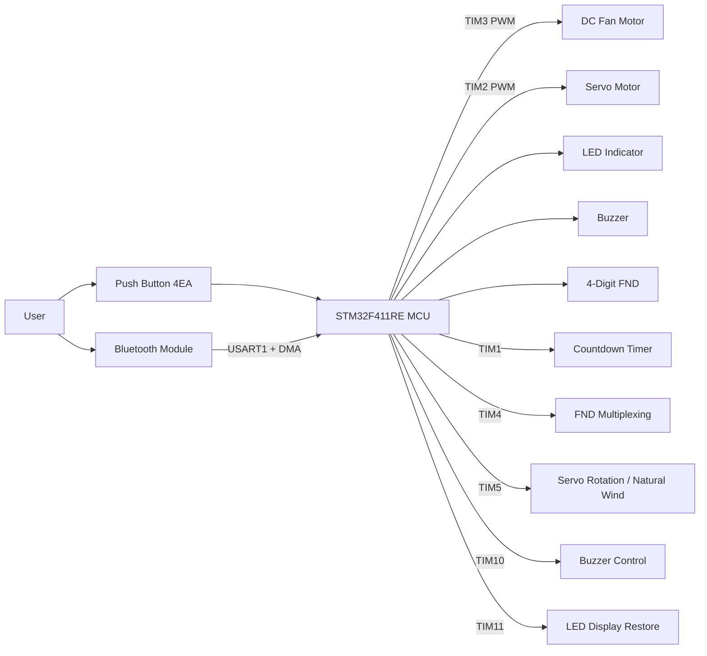
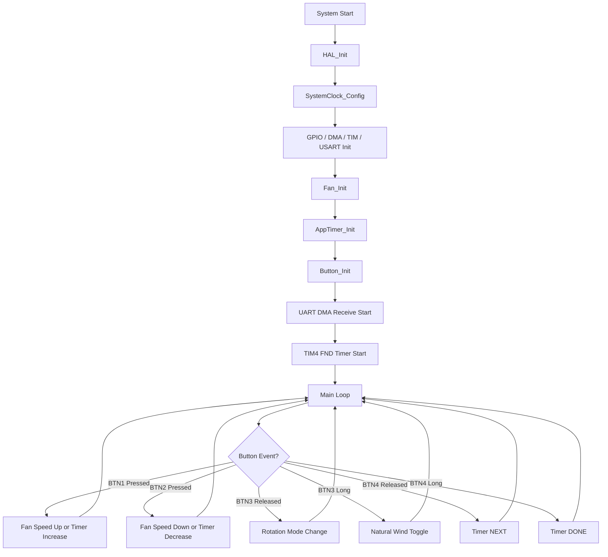
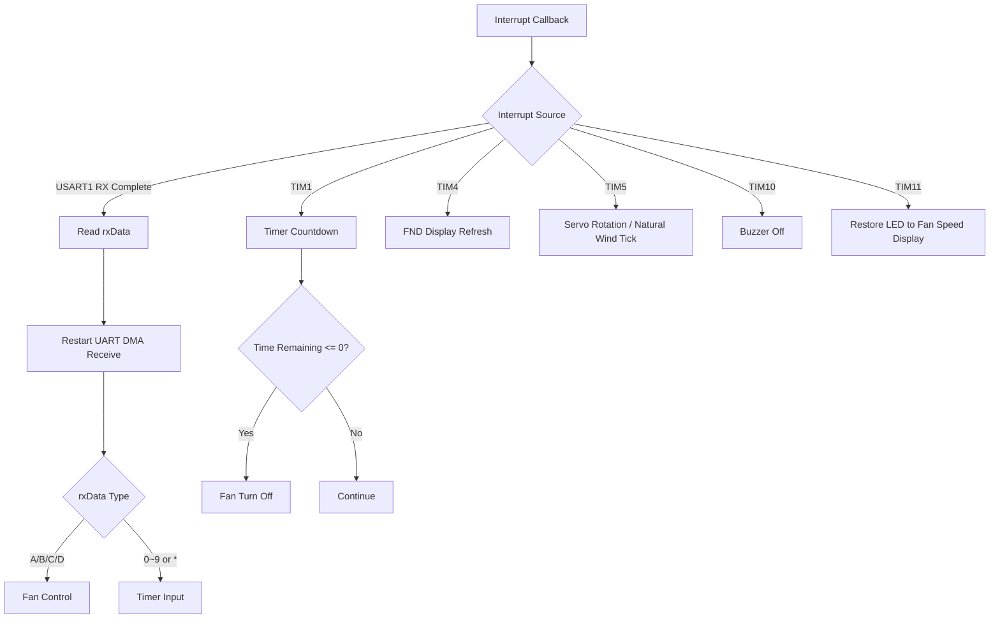

# Fan - STM32 Smart Fan Controller

## 1. 프로젝트 요약

여러 기능을 아우르는 스마트 선풍기 입니다.
버튼 입력과 블루투스 UART 통신을 이용해 선풍기의 풍량, 회전 각도, 자연풍 모드, 타이머 기능을 제어할 수 있도록 구현

<br>

## 2. 주요 기능

* 총 8단계 풍량 조절
* 회전 모드는 `정지 → 45도 → 90도 → 180도 → 정지` 순서로 전환
* 버튼 또는 블루투스로 자연풍 모드
* 블루투스 숫자 입력을 이용한 타이머 설정 지원

<br>

## 3. 기술 스택 및 개발 환경

### 3.1 Language


### 3.2 Development Tool


### 3.3 Hardware

| 구분            | 내용             |
| ------------- | ---------------- |
| MCU           | STM32F411RE      |
| Motor         | DC Motor         |
| Servo         | Servo Motor      |
| Display       | 4-Digit FND      |
| Communication | Bluetooth Module |
| Input         | Push Button 4개   |
| Output        | LED, Buzzer      |
| Driver        | STM32 HAL Driver |

### 3.4 Peripheral

| Peripheral   | 사용 목적             |
| ------------ | ----------------- |
| TIM1         | 타이머 카운트다운         |
| TIM2 PWM CH1 | 서보모터 제어           |
| TIM3 PWM CH1 | DC 모터 풍량 제어       |
| TIM4         | FND 멀티플렉싱         |
| TIM5         | 서보모터 회전 및 자연풍 처리  |
| TIM10        | 부저 OFF 처리         |
| TIM11        | 회전 모드 LED 표시 후 복귀 |
| USART1 + DMA | 블루투스 수신           |

<br>

## 4. 프로젝트 구조

### 4.1 Project Tree

```bash
Fan/
├── Core/
│   ├── Inc/
│   │   ├── app_timer.h
│   │   ├── button.h
│   │   ├── dma.h
│   │   ├── fan_controller.h
│   │   ├── gpio.h
│   │   ├── led.h
│   │   ├── main.h
│   │   ├── stm32f4xx_hal_conf.h
│   │   ├── stm32f4xx_it.h
│   │   ├── tim.h
│   │   └── usart.h
│   │
│   ├── Src/
│   │   ├── app_timer.c
│   │   ├── button.c
│   │   ├── dma.c
│   │   ├── fan_controller.c
│   │   ├── gpio.c
│   │   ├── led.c
│   │   ├── main.c
│   │   ├── stm32f4xx_hal_msp.c
│   │   ├── stm32f4xx_it.c
│   │   ├── syscalls.c
│   │   ├── sysmem.c
│   │   ├── system_stm32f4xx.c
│   │   ├── tim.c
│   │   └── usart.c
│   │
│   └── Startup/
│       └── startup_stm32f411retx.s
│
├── Drivers/
│   ├── CMSIS/
│   └── STM32F4xx_HAL_Driver/
│
├── Fan.ioc
├── STM32F411RETX_FLASH.ld
├── STM32F411RETX_RAM.ld
├── .project
├── .cproject
└── README.md
```

> `Debug/` 폴더는 빌드 결과물이므로 GitHub 업로드 대상에서 제외하는 것이 좋습니다.

### 4.2 주요 파일 설명

| 파일                 | 설명                                             |
| ------------------ | ---------------------------------------------- |
| `main.c`           | 시스템 초기화, 버튼 이벤트 처리, UART 수신 콜백, 타이머 인터럽트 콜백 관리 |
| `fan_controller.c` | 풍량 제어, 서보모터 회전 제어, 자연풍 모드, 선풍기 OFF 처리          |
| `app_timer.c`      | 타이머 시작/정지, 버튼 기반 타이머 설정, FND 출력, 카운트다운 처리      |
| `button.c`         | 버튼 디바운싱, 짧게 누르기, 길게 누르기 이벤트 처리                 |
| `led.c`            | 풍량 단계 및 회전 모드 표시용 LED 제어                       |
| `tim.c`            | TIM1, TIM2, TIM3, TIM4, TIM5, TIM10, TIM11 설정  |
| `usart.c`          | USART1 블루투스 통신 설정                              |
| `gpio.c`           | 버튼, LED, FND, 부저 GPIO 설정                       |

<br>

## 5. 하드웨어 블록 다이어그램



이미지 파일로 따로 넣고 싶다면 아래처럼 사용할 수 있습니다.

```md

```

<br>

## 6. 플로우차트

### 6.1 전체 동작 흐름



### 6.2 인터럽트 처리 흐름



<br>

## 7. Troubleshooting

### 7.1 버튼 입력이 한 번에 여러 번 들어가는 문제

#### 문제 상황

버튼을 한 번만 눌렀는데 풍량이 여러 단계 올라가거나, 의도하지 않은 동작이 여러 번 실행되는 문제가 발생했습니다.

#### 원인

물리 버튼은 누르는 순간 접점이 흔들리면서 짧은 시간 동안 ON/OFF가 반복되는 채터링 현상이 발생할 수 있습니다.

#### 해결 방법

`button.c`에서 50ms 디바운싱 시간을 적용했습니다.

```c
#define DEBOUNCE_MS 50
```

버튼 입력이 들어와도 일정 시간이 지나 안정적으로 유지될 때만 실제 입력으로 판단하도록 처리했습니다.

#### 결과

버튼을 한 번 눌렀을 때 하나의 이벤트만 발생하도록 안정화되었습니다.

---

### 7.2 짧게 누르기와 길게 누르기 구분 문제

#### 문제 상황

BTN3, BTN4에 여러 기능을 넣으면서 짧게 누르기와 길게 누르기가 구분되지 않는 문제가 있었습니다.

#### 원인

버튼을 누른 시점과 떼는 시점을 따로 관리하지 않으면 입력 유지 시간을 기준으로 동작을 구분하기 어렵습니다.

#### 해결 방법

`Button_t` 구조체에 버튼이 눌린 시간과 길게 누르기 처리 여부를 저장했습니다.

```c
uint32_t pressStartTime;
bool longPressHandled;
```

2초 이상 누르고 있으면 `BTN_LONG` 이벤트를 발생시키고, 길게 누르기가 이미 처리된 경우 버튼을 뗄 때 `BTN_RELEASED`가 중복 실행되지 않도록 했습니다.

#### 결과

하나의 버튼으로도 짧게 누르기와 길게 누르기 동작을 안정적으로 분리할 수 있었습니다.

---

### 7.3 자연풍 모드에서 풍량이 너무 급격하게 바뀌는 문제

#### 문제 상황

자연풍 모드에서 랜덤 풍량을 바로 PWM에 반영하면 바람 세기가 갑자기 바뀌어 부자연스러운 문제가 발생했습니다.

#### 원인

랜덤으로 정한 목표 풍량과 현재 풍량의 차이가 클 경우 PWM 값이 급격히 변합니다.

#### 해결 방법

`fan_controller.c`에서 지수이동평균을 적용했습니다.

```c
#define EMA_ALPHA 0.003f
```

목표 풍량을 바로 적용하지 않고, 현재 풍량이 목표 풍량을 천천히 따라가도록 처리했습니다.

#### 결과

풍량 변화가 부드러워졌고, 실제 자연풍과 유사한 느낌을 구현할 수 있었습니다.

---

### 7.4 FND 표시와 다른 기능이 동시에 동작할 때 불안정한 문제

#### 문제 상황

FND 표시, 타이머 카운트다운, 서보모터 회전, 자연풍 제어가 동시에 실행되어야 했습니다.
모든 기능을 메인 루프에서 처리하면 특정 기능이 다른 기능을 지연시킬 수 있었습니다.

#### 원인

FND는 빠르게 자리 선택을 반복해야 하고, 타이머는 1초 단위로 감소해야 하며, 서보모터와 자연풍은 주기적으로 갱신되어야 합니다.
각 기능의 실행 주기가 다르기 때문에 하나의 루프에서 모두 처리하면 정확한 타이밍을 맞추기 어렵습니다.

#### 해결 방법

기능별로 타이머 인터럽트를 분리했습니다.

| Timer | 역할                        |
| ----- | ------------------------- |
| TIM1  | 타이머 카운트다운                 |
| TIM4  | FND 멀티플렉싱                 |
| TIM5  | 서보모터 회전 및 자연풍 제어          |
| TIM10 | 부저 OFF                    |
| TIM11 | 회전 모드 LED 표시 후 풍량 LED로 복귀 |

#### 결과

각 기능이 독립적인 주기로 동작하게 되어 FND 표시, 타이머, 회전 제어, 자연풍 제어가 안정적으로 동작했습니다.

---

### 7.5 블루투스 입력이 한 번만 처리되는 문제

#### 문제 상황

블루투스 명령을 한 번 받은 뒤 다음 명령이 제대로 처리되지 않을 수 있었습니다.

#### 원인

UART DMA 수신은 수신 완료 후 다음 수신을 다시 시작해야 계속 데이터를 받을 수 있습니다.

#### 해결 방법

`HAL_UART_RxCpltCallback()` 안에서 데이터를 처리하기 전에 다음 DMA 수신을 다시 시작했습니다.

```c
HAL_UART_Receive_DMA(&huart1, &rxData, 1);
```

#### 결과

블루투스 명령을 연속으로 보내도 계속 수신할 수 있도록 개선되었습니다.

---

### 7.6 회전 모드 표시 LED와 풍량 표시 LED가 겹치는 문제

#### 문제 상황

회전 모드 변경 시 LED로 회전 범위를 표시해야 하지만, 기존 LED는 풍량 표시에도 사용되고 있었습니다.

#### 원인

같은 LED를 풍량 표시와 회전 모드 표시가 함께 사용하기 때문에, 회전 모드 표시 후 다시 풍량 표시 상태로 되돌리는 처리가 필요했습니다.

#### 해결 방법

회전 모드 변경 시 LED를 잠시 회전 모드 표시용으로 사용하고, TIM11을 이용해 3초 후 다시 풍량 LED 표시로 복구했습니다.

```c
HAL_TIM_Base_Start_IT(&htim11);
```

TIM11 인터럽트 발생 시 `Fan_RotationDisplayTimeout()`을 호출하여 LED를 복구했습니다.

#### 결과

회전 모드 변경 상태를 사용자에게 표시하면서도, 일정 시간이 지나면 다시 현재 풍량을 표시할 수 있게 되었습니다.

<br>

## 실행 결과

본 프로젝트를 통해 STM32 환경에서 다음 기능을 구현했습니다.

* GPIO 기반 버튼 입력 처리
* 버튼 디바운싱
* 짧게 누르기 / 길게 누르기 이벤트 분리
* PWM 기반 DC 모터 제어
* PWM 기반 서보모터 제어
* UART DMA 기반 블루투스 제어
* FND 멀티플렉싱 출력
* 타이머 인터럽트 기반 기능 분리
* 자연풍 알고리즘 구현
* 모듈 단위 코드 분리

<br>

## 개선 사항

* LCD 또는 OLED를 추가하여 현재 모드와 타이머 상태를 더 직관적으로 표시
* 온습도 센서를 추가하여 주변 환경에 따라 자동 풍량 조절
* 블루투스 앱 UI를 제작하여 버튼식 명령 대신 화면 기반 제어 구현
* 현재 동작 상태를 EEPROM 또는 Flash에 저장하여 전원 재시작 후에도 이전 상태 복원
* 회전 각도와 풍량 단계를 사용자가 직접 설정할 수 있도록 기능 확장
