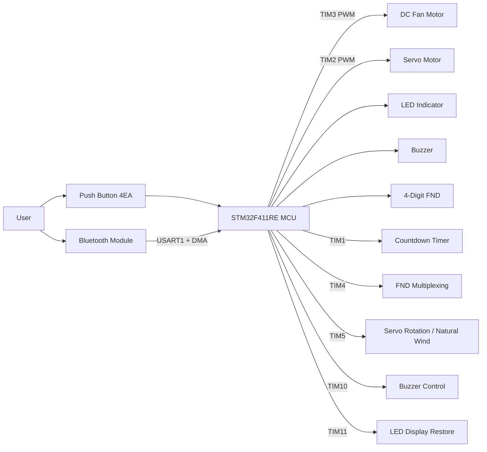
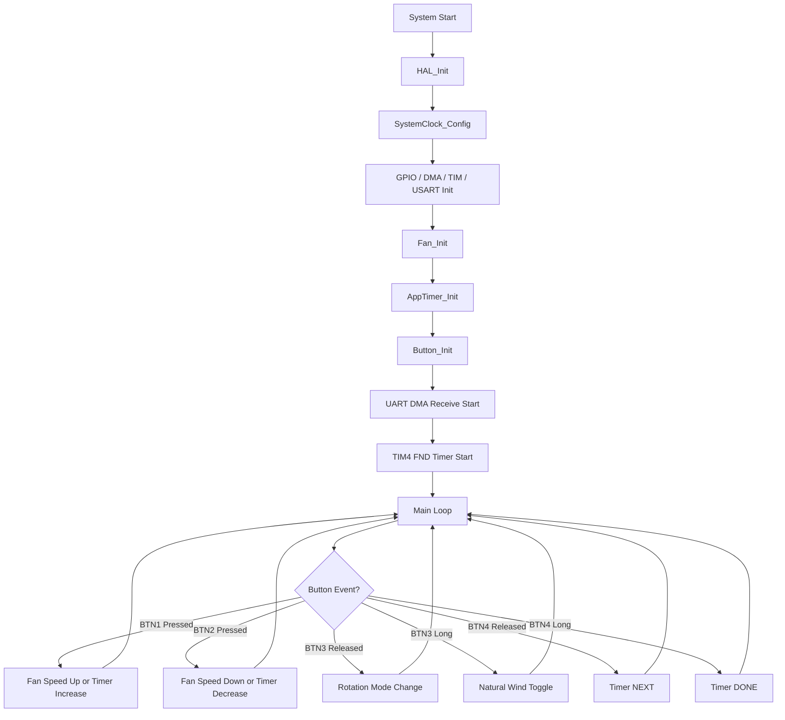
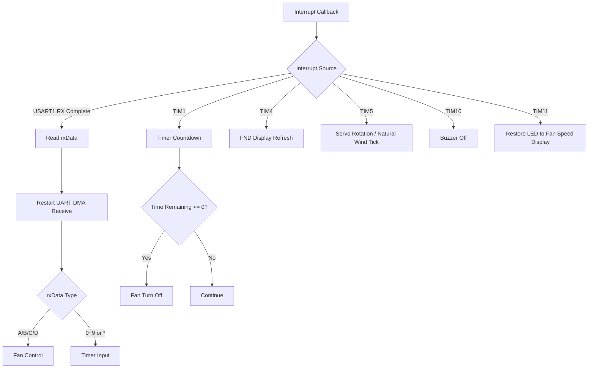

# Smart Fan

## 1. 프로젝트 요약

여러 기능을 아우르는 스마트 선풍기 입니다.
버튼 입력과 블루투스 UART 통신을 이용해 선풍기의 풍량, 회전 각도, 자연풍 모드, 타이머 기능을 제어할 수 있도록 구현

<br>

## 2. 주요 기능

* 총 8단계 풍량 조절
* 회전 모드는 `정지 → 45도 → 90도 → 180도 → 정지` 순서로 전환
* 버튼 또는 블루투스로 자연풍 모드
* 블루투스 숫자 입력을 이용한 타이머 설정 지원

<br>

## 3. 기술 스택 및 개발 환경

### 3.1 Language


### 3.2 Development Tool


### 3.3 Hardware

| 구분            | 내용             |
| ------------- | ---------------- |
| MCU           | STM32F411RE      |
| Motor         | DC Motor         |
| Servo         | Servo Motor      |
| Display       | 4-Digit FND      |
| Communication | Bluetooth Module |
| Input         | Push Button 4개   |
| Output        | LED, Buzzer      |
| Driver        | STM32 HAL Driver |

### 3.4 Peripheral

| Peripheral   | 사용 목적             |
| ------------ | ----------------- |
| TIM1         | 타이머 카운트다운         |
| TIM2 PWM CH1 | 서보모터 제어           |
| TIM3 PWM CH1 | DC 모터 풍량 제어       |
| TIM4         | FND 멀티플렉싱         |
| TIM5         | 서보모터 회전 및 자연풍 처리  |
| TIM10        | 부저 OFF 처리         |
| TIM11        | 회전 모드 LED 표시 후 복귀 |
| USART1 + DMA | 블루투스 수신           |

<br>

## 4. 프로젝트 구조

```bash
Fan/
├── Core/
│   ├── Inc/                     # 각 소스 모듈에 대응하는 헤더 파일 (.h)
│   └── Src/                     # 프로젝트 핵심 로직 구현부 (.c)
│       ├── main.c               # 하드웨어 초기화 및 전체 시스템 제어 루프
│       ├── fan_controller.c     # 팬 속도, 회전 모드, 자연풍 제어
│       ├── app_timer.c          # 타이머 설정, 카운트다운, FND 출력 처리
│       ├── button.c             # 버튼 입력, 디바운싱, 짧게/길게 누르기 처리
│       ├── led.c                # 풍량 및 회전 상태 LED 표시
│       ├── tim.c                # PWM 및 타이머 인터럽트 설정
│       ├── usart.c              # 블루투스 UART 통신 설정
│       ├── dma.c                # UART DMA 수신 설정
│       └── gpio.c               # GPIO 핀 설정
│
├── Drivers/                     # STM32 HAL 드라이버 및 CMSIS 라이브러리
├── images/                      # 프로젝트 시연 이미지 및 다이어그램 리소스
├── Fan.ioc                      # STM32CubeMX 하드웨어 구성 및 핀 설정 파일
├── STM32F411RETX_FLASH.ld       # Flash 메모리 링커 스크립트
├── STM32F411RETX_RAM.ld         # RAM 메모리 링커 스크립트
└── README.md                    # 프로젝트 전체 가이드 문서
```

<br>

## 5. 하드웨어 블록 다이어그램



이미지 파일로 따로 넣고 싶다면 아래처럼 사용할 수 있습니다.

```md

```

<br>

## 6. 플로우차트

### 6.1 전체 동작 흐름



### 6.2 인터럽트 처리 흐름



<br>

## 7. Troubleshooting

### 7.1 짧게 누르기와 길게 누르기 구분 문제

#### 문제 상황

BTN3, BTN4에 여러 기능을 넣으면서 짧게 누르기와 길게 누르기가 구분되지 않는 문제

#### 원인

버튼을 누른 시점과 떼는 시점을 따로 관리하지 않으면 입력 유지 시간을 기준으로 동작을 구분하기 어렵습니다.

#### 해결 방법

`Button_t` 구조체에 버튼이 눌린 시간과 길게 누르기 처리 여부를 저장

```c
uint32_t pressStartTime;
bool longPressHandled;
```

2초 이상 누르고 있으면 `BTN_LONG` 이벤트를 발생시키고, 길게 누르기가 이미 처리된 경우 버튼을 뗄 때 `BTN_RELEASED`가 중복 실행되지 않도록 설정


### 7.2 자연풍 모드에서 풍량이 너무 급격하게 바뀌는 문제

#### 문제 상황

자연풍 모드에서 랜덤 풍량을 바로 PWM에 반영하면 바람 세기가 갑자기 바뀌어 부자연스러운 문제가 발생했습니다.

#### 원인

랜덤으로 정한 목표 풍량과 현재 풍량의 차이가 클 경우 PWM 값이 급격히 변합니다.

#### 해결 방법

`fan_controller.c`에서 지수이동평균을 적용

```c
#define EMA_ALPHA 0.003f
```

목표 풍량을 바로 적용하지 않고, 현재 풍량이 목표 풍량을 천천히 따라가도록 처리

---

### 7.3 FND 표시와 다른 기능이 동시에 동작할 때 불안정한 문제

#### 문제 상황

FND 표시, 타이머 카운트다운, 서보모터 회전, 자연풍 제어가 동시에 실행될 때, 순서가 꼬이거나 제대로 작동하지 않는 문제

#### 원인

각 기능의 실행 주기가 다르기 때문에 하나의 루프에서 모두 처리했기 때문

#### 해결 방법

기능별로 타이머 인터럽트를 분리함

| Timer | 역할                        |
| ----- | ------------------------- |
| TIM1  | 타이머 카운트다운                 |
| TIM4  | FND 멀티플렉싱                 |
| TIM5  | 서보모터 회전 및 자연풍 제어          |
| TIM10 | 부저 OFF                    |
| TIM11 | 회전 모드 LED 표시 후 풍량 LED로 복귀 |


---

### 7.4 회전 모드 표시 LED와 풍량 표시 LED가 겹치는 문제

#### 문제 상황

회전 모드 변경 시 LED로 회전 범위를 표시해야 하는데, 기존 LED는 풍량 표시에도 사용 중이어서 LED가 겹치는 상황이 발생

#### 원인

같은 LED를 풍량 표시와 회전 모드 표시가 함께 사용했기 때문

#### 해결 방법

회전 모드 변경 시 LED를 잠시 회전 모드 표시용으로 사용하고, TIM11을 이용해 3초 후 다시 풍량 LED 표시로 복구함

```c
HAL_TIM_Base_Start_IT(&htim11);
```

TIM11 인터럽트 발생 시 `Fan_RotationDisplayTimeout()`을 호출하여 LED를 복구했습니다.


<br>


## 개선 사항

* LCD 또는 OLED를 추가하여 현재 모드와 타이머 상태를 더 직관적으로 표시
* 온습도 센서를 추가하여 주변 환경에 따라 자동 풍량 조절
* 블루투스 앱 UI를 제작하여 버튼식 명령 대신 화면 기반 제어 구현
* 현재 동작 상태를 EEPROM 또는 Flash에 저장하여 전원 재시작 후에도 이전 상태 복원
* 회전 각도와 풍량 단계를 사용자가 직접 설정할 수 있도록 기능 확장
